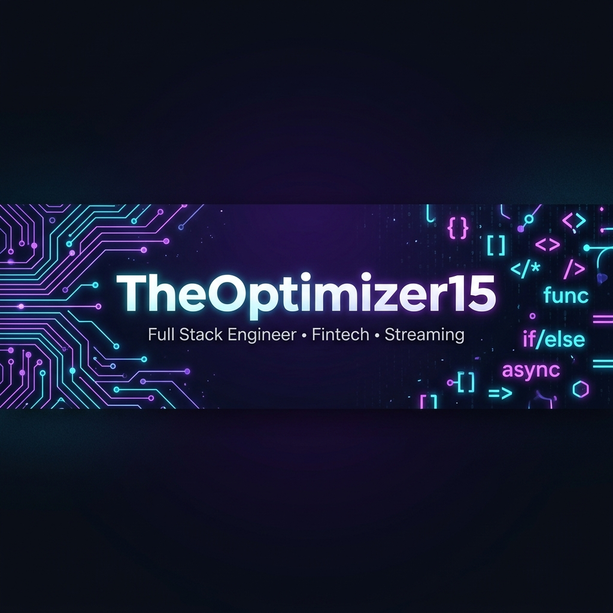

<div align="center">



</div>

<!-- Animated typing SVG -->
<div align="center">
  <a href="https://git.io/typing-svg">
    
  </a>
</div>

<br/>

<div align="center">

[](https://github.com/NLSdotDEV)
[](https://github.com/NLSdotDEV?tab=followers)
[](mailto:ndris219@gmail.com)

</div>

---

<!-- About Me -->


### 🧠 About Me

```typescript
const samuel = {
  alias:     "TheOptimizer15",
  role:      "Full Stack Engineer",
  location:  "🌍 West Africa",
  passions:  ["Fintech", "Streaming", "API Design"],

  currently: {
    building:  "NexStream — Multi-platform IPTV platform",
    integrating: "Wave & Orange Money payment flows",
    studying:  "Distributed systems & microservices",
  },

  philosophy: "Ship fast. Observe everything. Break nothing.",
};
```

- 🔭 I build systems that **handle money, media & scale**
- ⚡ Deep expertise in **payment automation** (Wave, Orange Money, JEKO)
- 📡 Architecting **IPTV/streaming backends** with real-time dashboards
- 🛡️ Obsessed with **observability** — structured logs, Telegram alerts, Sentry
- 🤝 Open to **freelance & consulting** engagements

<br clear="right"/>

---

## 🚀 Featured Projects

<table>
  <tr>
    <td width="50%">
      <h3 align="center">⚡ NexStream</h3>
      <div align="center">
        
        
        
      </div>
      <p align="center">Multi-platform IPTV streaming service with real-time STB MAC validation, live category sync, queue-based job processing, and full Telegram observability.</p>
    </td>
    <td width="50%">
      <h3 align="center">💳 Wave Sync</h3>
      <div align="center">
        
        
        
      </div>
      <p align="center">Mobile payment automation platform. Intercepts GraphQL packets from the Wave Business Portal, automates transaction processing, and handles merchant config failures gracefully.</p>
    </td>
  </tr>
  <tr>
    <td width="50%">
      <h3 align="center">🗺️ Poto-Map API</h3>
      <div align="center">
        
        
        
      </div>
      <p align="center">Microservices-based backend for a location-aware social marketplace. Handles complex geospatial queries, service-repository pattern, and typed PHP-style domain modeling in TS.</p>
    </td>
    <td width="50%">
      <h3 align="center">🛒 Qbox</h3>
      <div align="center">
        
        
        
      </div>
      <p align="center">Full e-commerce & inventory platform for SMEs. Integrates JEKO Direct Provider Checkout for Wave & Orange Money with a custom-branded mobile payment flow.</p>
    </td>
  </tr>
  <tr>
    <td colspan="2">
      <h3 align="center">📱 Postufly</h3>
      <div align="center">
        
        
      </div>
      <p align="center">Mobile app automating the job search and application submission process — reducing search time by 80% through intelligent filtering and workflow automation.</p>
    </td>
  </tr>
</table>

---

## 🛠️ Tech Stack & Expertise

<div align="center">

### Languages


### Backends & Frameworks


### Frontend


### Data & Infrastructure


### Observability & Tools


</div>

---

## 📊 GitHub Analytics

<div align="center">
  
  
</div>

<div align="center">
  
</div>

<div align="center">
  
</div>

---

## 💡 What I Do Best

<div align="center">

| 🏗️ Domain | 💼 What I Build |
|:---|:---|
| **Payment & Fintech** | Wave Business automations, GraphQL interception, Orange Money & JEKO integrations |
| **Streaming & IPTV** | NexStream platform, STB MAC lifecycle, live category sync, real-time dashboards |
| **API Architecture** | Laravel & NestJS REST/GraphQL APIs, service-repository patterns, domain modeling |
| **Observability** | Structured logs, Telegram alerting, Sentry error tracking, queue monitoring |
| **Browser Automation** | Puppeteer workflows, reliable scrapers, multi-step form automation |
| **MVP Development** | Rapid prototyping, full-stack delivery, React/React Native/Svelte frontends |

</div>

---

## 🌐 Connect & Collaborate

<div align="center">

[](mailto:ndris219@gmail.com)
[](https://github.com/NLSdotDEV)

<br/>

> *"Ship fast. Observe everything. Break nothing."*

<br/>


</div>
